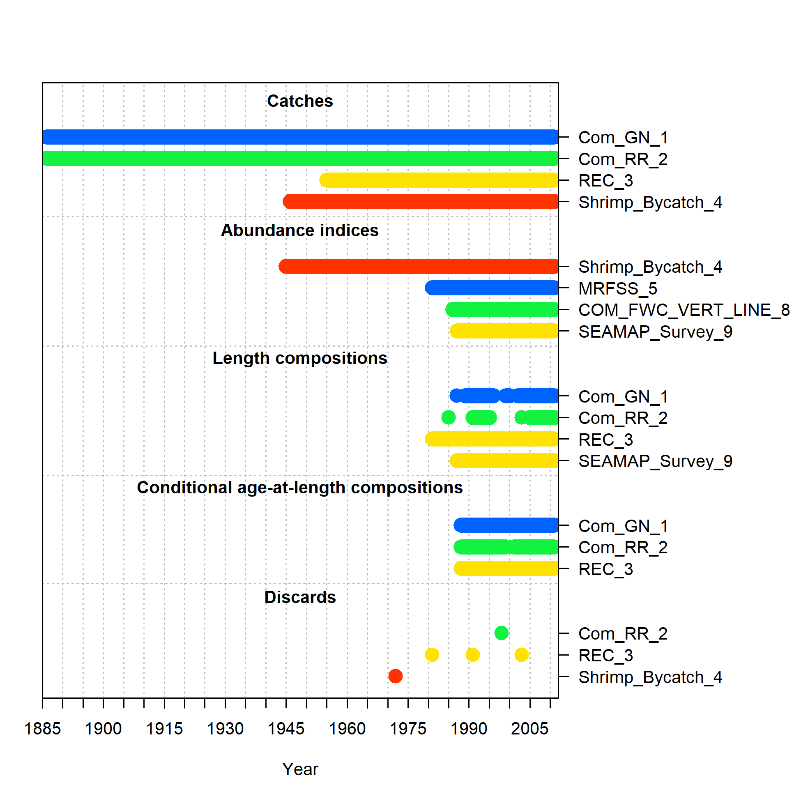

# [SEDAR 89](https://sedarweb.org/assessments/sedar-89-south-atlantic-tilefish/?customize_changeset_uuid=dac65e6f-d48f-41f0-8125-a7ae0e1325cb) South Atlantic Golden Tilefish Operational Assessment 

# [Stock Structure and Assessment Details](https://github.com/KellyAdler-NOAA/SEFSC-SEDAR-SA-89OA-TIL-2022/edit/main/docs/index.md) 

+ [Project schedule](https://sedarweb.org/documents/sedar-tilefish-schedule-3-23-23-pdf/?customize_changeset_uuid=dac65e6f-d48f-41f0-8125-a7ae0e1325cb)
+ [Terms of Reference](https://sedarweb.org/documents/final_sedar89_tilefish_tors3-23-23-pdf/?customize_changeset_uuid=dac65e6f-d48f-41f0-8125-a7ae0e1325cb)
+ [Last Assessment (SEDAR 66, 2021)](https://sedarweb.org/assessments/sedar-66/?customize_changeset_uuid=dac65e6f-d48f-41f0-8125-a7ae0e1325cb)

**Species**:
Golden Tilefish (*Lopholatilus chamaeleonticeps*; [ITIS=168546](https://www.itis.gov/servlet/SingleRpt/SingleRpt?search_topic=TSN&search_value=168546#null))

**Topical Working Groups**:
  + Week of January 22, 2024; Life History Topical Working Group Webinar I
  + Week of February 12, 2024; Life History Topical Working Group Webinar II
  + Week of March 11, 2024; Life History Topical Working Group Webinar III
  + Week of April 22, 2024; Life History Topical Working Group Webinar IV (if needed) 

**Year range**: YYYY-YYYY (Previous Assessment: YYYY-YYYY)

**Commercial**:  
  + *Boundary*: Statistical grids 1-21, North of US Highway 1 in the Florida Keys and North of the boundary line that extends from Key West to the Dry Tortugas
      + Specify subareas 744.001, 748.001, etc.
      + Include table of subareas to include? Particularly relevant for south Florida
  + *Fleet structure*: (1) Commercial Gillnet (+ Other), (2) Commercial Handlines (+ Other)
  ("Other" gears apportioned among Gillnet and Handline gears based on the annual proportions of landings by those two gears.)
      + Specify if this aggregation holds for length and age compositions (or if other/unknown gears are excluded)
      + Include table of fleet aggregations using FIN gear codes?
  + *Landings units*: Pounds whole weight

**Recreational**:  
  + *Boundary*: Gulf of Mexico states from Texas to the Florida Keys at the Dade-Monroe County line
  + *Fleet structure*: (1) Recreational modes combined (Charter, Private, Shore and Headboat)  
      + Where relevant, include distinction between shore/private as some surveys (LA Creel) do not distinguish between these modes  
  + *Landings units*: Number of fish , pounds whole weight (indicate if one or both are requested)

**Indices**:  
  + *Recreational (MRFSS/MRIP) Index*: Number of fish caught per angler hour
  + *FWC Trip Ticket Vertical Line Index*: Pounds per trip    
  + *SEAMAP Independent Fishery Trawl Survey Index*: Full model incorporating summer and fall datasets, number of fish per trawl hour
  + *Shrimp Bycatch Fishery Effort Time Series*: Days fished

**Composition Data Input Sample Sizes**: Number of trips, number of fish (indicate if one or both are requested)

**Length Bins and Units**: 4 cm fork length (FL) - 100 cm FL in 2 cm bins (indicate if lower inclusive or midpoints are requested--currently, GM is lower inclusive and SA is midpoint)

**Ages**: 0-11 years with 11 as plus group for compositions

**Data Overview from Previous Assessment**:

**Points of Contact**

*Lead Assessment Analyst:* Matthew Vincent, matthew.vincent@noaa.gov

*Assessment Coordinator:* Kelly Adler, kelly.adler@noaa.gov 

# Disclaimer

This repository is a scientific product and is not official communication of the National Oceanic and Atmospheric Administration, or the United States Department of Commerce. All NOAA GitHub project code is provided on an ‘as is’ basis and the user assumes responsibility for its use. Any claims against the Department of Commerce or Department of Commerce bureaus stemming from the use of this GitHub project will be governed by all applicable Federal law. Any reference to specific commercial products, processes, or services by service mark, trademark, manufacturer, or otherwise, does not constitute or imply their endorsement, recommendation or favoring by the Department of Commerce. The Department of Commerce seal and logo, or the seal and logo of a DOC bureau, shall not be used in any manner to imply endorsement of any commercial product or activity by DOC or the United States Government.
